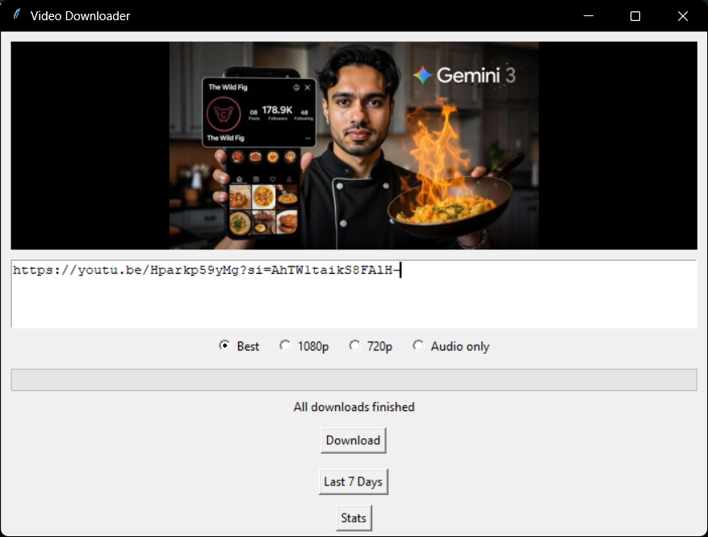
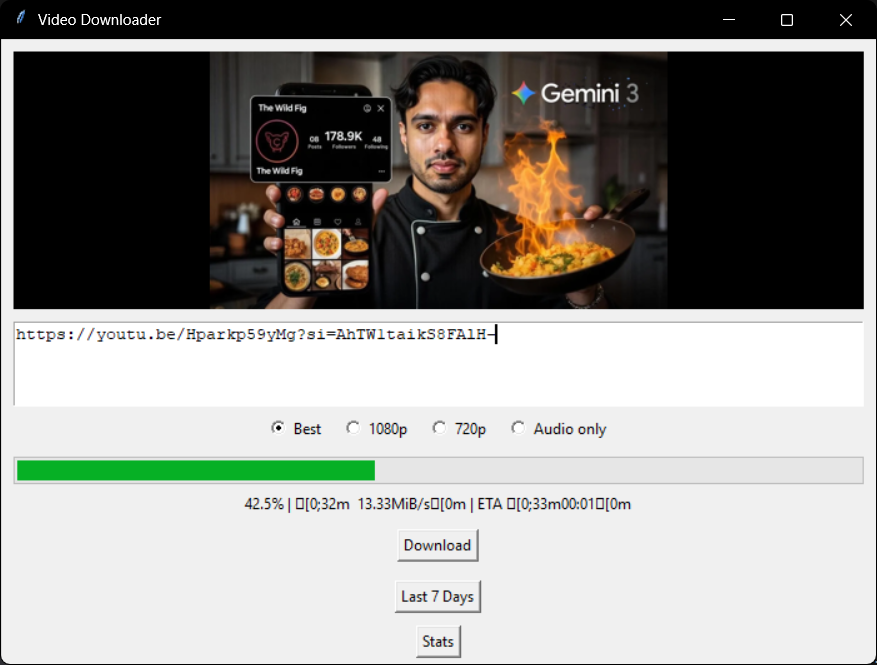
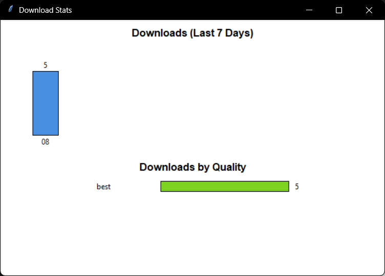

# Video Downloader

Video Downloader is a Python-based desktop application that allows you to download videos and audio from supported websites using a simple and responsive graphical interface.

The project focuses on practicality: queue-based downloads, clear progress feedback, local history tracking, and zero reliance on cloud services or accounts.

---

## Features

## Screenshots






### Core Downloading
- Download videos and audio from YouTube, TikTok, Instagram, and hundreds of other supported sites (via `yt-dlp`)
- Supports multiple URLs at once using a download queue
- Downloads are processed sequentially to avoid UI freezing

### Quality Options
- Best available quality
- 1080p
- 720p
- Audio-only (MP3)

### User Interface
- Desktop GUI built with Tkinter
- Responsive layout that resizes correctly with the window
- Live progress bar with speed and ETA
- Thumbnail preview loaded automatically from the video URL

### Download History
- All completed downloads are stored locally in an SQLite database
- History includes:
  - Video title
  - File path
  - Selected quality
  - Download timestamp
- View downloads from the last 7 days
- Double-click a history entry to open the downloaded file

### Statistics
- Visual statistics dashboard showing:
  - Downloads per day (last 7 days)
  - Downloads grouped by quality
- All statistics are generated locally from the database

### Privacy & Design
- No ads
- No tracking
- No accounts
- No cloud storage
- All data stays on the user’s machine

---

## Project Structure
VideoDownloader/
│
├── main.py # Application entry point
├── ui.py # Main GUI logic
├── downloads.db # Local database (auto-created, not tracked)
│
├── downloader_engine/
│ ├── init.py
│ ├── downloader.py # yt-dlp download logic
│ └── metadata.py # Fetch video metadata & thumbnails
│
├── effects_layer/
│ ├── init.py
│ └── progress_bar.py # Progress parsing utilities
│
├── output_manager/
│ ├── init.py
│ └── history.py # SQLite history & statistics logic
│
└── README.md


---

## Requirements

### Software
- Python **3.11** or **3.12** (recommended)
- FFmpeg (required for merging video/audio and MP3 extraction)

### Python Dependencies
Install required packages:

```bash
pip install yt-dlp pillow


FFmpeg Setup (Important)
 FFmpeg is required for:
 - Merging video and audio streams
 - Converting audio-only downloads to MP3

Windows (simple method)
1. Download FFmpeg from: https://www.gyan.dev/ffmpeg/builds/
2. Extract the archive
3. Copy ffmpeg.exe into the project root folder or add it to your system PATH

Verify installation:

```bash
ffmpeg -version


How to Run the Application

From the project root:
```bash
python main.py
```
Do not run ui.py directly.
main.py initializes the database and starts the UI correctly.


How to Use
1. Paste one or more video URLs into the text box (one per line)
2. Select the desired quality
3. Click Download
4. Monitor progress in real time
5. Access recent downloads via Last 7 Days
6. Open downloaded files by double-clicking them
7. View usage analytics in Stats

Internal Modules Overview
downloader_engine/downloader.py

Handles all downloading logic using yt-dlp.
Responsibilities:
1. Apply quality settings
2. Track download progress
3. Return downloaded file metadata

downloader_engine/metadata.py
Fetches video metadata without downloading:
1. Title
2. Thumbnail URL
Used for previewing content before download.

effects_layer/progress_bar.py
Parses yt-dlp progress hooks and converts raw data into:
1. Percentage
2. Speed
3. ETA
Keeps UI logic clean and separate.

output_manager/history.py
Manages the SQLite database:
1. Creates tables automatically
2. Logs completed downloads
3. Retrieves last 7 days of data
4. Generates statistics for the dashboard

Database Notes
1. The database file (downloads.db) is created automatically
2. It is stored locally
3. It should NOT be committed to GitHub
4. Deleting it resets history and stats

Intended Use
This project is intended for:
1. Personal use
2. Educational purposes
3. Downloading content you own or are permitted to download
Users are responsible for complying with the terms of service of the platforms they use.

License
This project is licensed under the Apache License 2.0.
You are free to use, modify, and distribute the code under the terms of this license.

Author Notes
This project was built to practice:
1. Desktop application design
2. Thread-safe GUI programming
3. Local data persistence
4. Modular Python architecture
It intentionally avoids cloud dependencies and external services beyond downloading.

